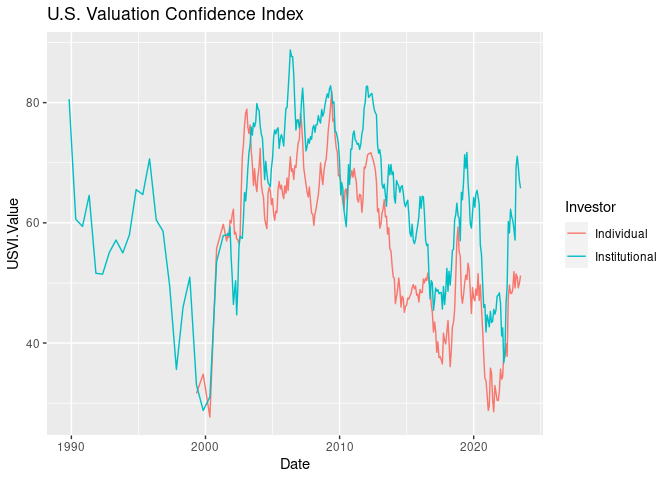

<!-- README.md is generated from README.Rmd. Please edit that file -->
Package `marketconf`: Stock Market Confidence Indexes
=====================================================

The R package `marketconf` reads **U. S. Stock Market Confidence Indexes** data from [Yale School of Management's International Center for Finance](https://som.yale.edu/faculty-research/our-centers-initiatives/international-center-finance/data/stock-market-confidence) web page.

This package is for stock market prediction and risk valuation, and it can be used with other packages like [`quantmod`](https://cran.r-project.org/web/packages/quantmod/index.html), [`TTR`](https://cran.r-project.org/web/packages/TTR/index.html) or [`tidyquant`](https://cran.r-project.org/web/packages/tidyquant/index.html)

Package installation
--------------------

``` r
library(devtools)
devtools::install_github("EnriquePH/marketconf")
```

Examples
--------

### List indices

The four U.S. Stock market confidence indexes are derived, monthly, from survey data on the behavior of investors, these indexes are:

``` r
library(marketconf)
library(knitr)

kable(US_confidence_indices())
```

| Symbol | Description                       | Url                                                                                                                                                                       |
|:-------|:----------------------------------|:--------------------------------------------------------------------------------------------------------------------------------------------------------------------------|
| US1YI  | U.S. One Year Index               | <https://som.yale.edu/faculty-research/our-centers-initiatives/international-center-finance/data/stock-market-confidence-indices/united-states-one-year-index>            |
| USVI   | U.S. Crash Confidence Index       | <https://som.yale.edu/faculty-research/our-centers-initiatives/international-center-finance/data/stock-market-confidence-indices/united-states-valuation-index>           |
| USBODI | U.S. Buy-On-Dips Confidence Index | <https://som.yale.edu/faculty-research/our-centers-initiatives/international-center-finance/data/stock-market-confidence-indices/united-states-buy-dips-confidence-index> |
| USCI   | U.S. Valuation Index              | <https://som.yale.edu/faculty-research/our-centers-initiatives/international-center-finance/data/stock-market-confidence-indices/us-crash-confidence-index>               |

### Plotting

This is a basic example which plots **U.S. Valuation Index**:

``` r
library(ggplot2)

index_df <- get_index("USVI")

ggplot(index_df, aes(x = Date, y = USVI.Value, color = Investor)) +
  geom_line()
```



License
-------

The `markerconf` package is under the **MIT License (MIT)**, but the **Stock Market Confidence Indexes** are produced and copyrighted by the **International Center of Finance at the Yale School of Management**. See [TERMS OF USE](https://som.yale.edu/faculty-research/centers-initiatives/international-center-for-finance/data/stock-market-confidence-indices/stock-market-confidence-indices) at [Yale University](https://som.yale.edu/)'s web page.
